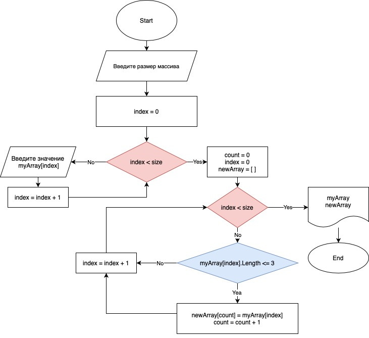

# Задача: 

*Написать программу, которая из имеющегося массива 
строк формирует новый массив из строк, длина которых меньше, 
либо равна 3 символам. Первоначальный массив можно ввести с 
клавиатуры, либо задать на старте выполнения алгоритма. 
При решении не рекомендуется пользоваться коллекциями, лучше 
обойтись исключительно массивами.*

***
## Примеры:
>[“Hello”, “2”, “world”, “:-)”] → [“2”, “:-)”]

>[“1234”, “1567”, “-2”, “computer science”] → [“-2”]

>[“Russia”, “Denmark”, “Kazan”] → [ ]
***

# Описание решения:
Для решения данной задачи на языке программирования С# необходимо создать несколько методов:
1. Метод ReadInt для принятия из консоли значения типа string и переконвертирование его в значение int.
1. Метод FillArray, который принимает аргумент size (размер массива типа string). Далее необходимо создать новый массив типа string, элементы которого последовательно заполняем из консоли используя цикл for. По окончанию цикла метод возвращает массив типа string.
1. Метод PrintArray принимает аргумент в виде одномерного массива типа string и выводит на консоль значения его элементов при помощи форматированного вывода и встроенного метода string.join().
1. Метод ArraySort принимает в виде аргументов массив типа string и значение stringLength по которому опряделяем значение нужной нам длинны строки элементов массива, равное которому и меньшее значение сохраняется в созданный новый массив (изначально нулевой). Заводим переменную-счетчик count с нулевым значением для работы с элементами нового массива. Далее циклом for проходим последоватнльно по значениям элементов массива из аргумента метода и проверяем, если длина строки элемента меньше или равна аргументу stringLength (по условию задачи эта длина не более 3 символов, но данный метод будет универсальный), то мы расширяем наш новый массив на 1 значение и сохраняем в него это элемент под индексом count, инкреминируем счетчик и продолжаем цикл. По окончанию цикла метод возвращает новый массив типа string, в котором хранятся отобранные нами элементы, согласно условиям задачи.

В основной части программы при помощи метода ReadInt получаем значение, которое сохраняем в переменной size, что является размером массива. Методом FillArray создаём и заполняем массив myArray размером size. Потом к новому массиву newArray применяем метод ArraySort с аргументом 3 и отбираем все элементы, длинна которых меньше или равна 3 символам. Затем выводим на консоль значения первичного массива myArray и нового массива newArray.

## Блок-схема решения задачи:

